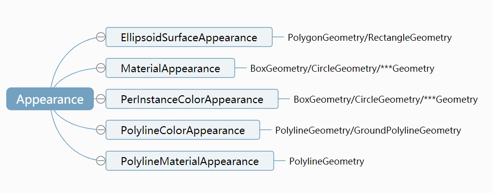
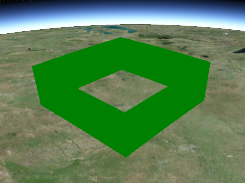
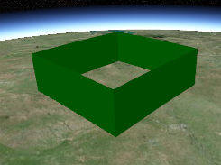
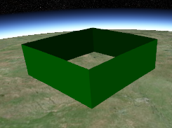

参考资料：  
https://github.com/AnalyticalGraphicsInc/cesium/wiki/Fabric  
https://www.cnblogs.com/cesium1/p/10063089.html  
https://www.jianshu.com/p/f8fee864379a

## Appearance 结构

Appearance 结构如下：  


## 内置材质：

```
polygon.material = Material.fromType('Image');
polygon.material.uniforms.image = 'image.png';


polygon.material = new Cesium.Material({
  fabric : {
    type : 'Image',
    uniforms : {
      image : 'image.png'
    }
  }
});

```

## 程序生成的纹理 （Procedural Textures）

程序生成的纹理，他们不依赖于外部图片文件，是通过 GPU 编程计算的图案，他们可以表示颜色和透明。

ktx 文件，针对显存做优化的纹理

## 外观

外观包含 flat 和 faceForward 属性, 这个直接控制了 GLSL 的着色效果：
flat - 纯色着色，不考虑光照效果，效果：。
faceForward - 当有光照的的时候，当视图正对它的时候反转法向量，避免墙体的背面是黑色的。
flat : true | faceForward : false | faceForward : true |
效果： 。
