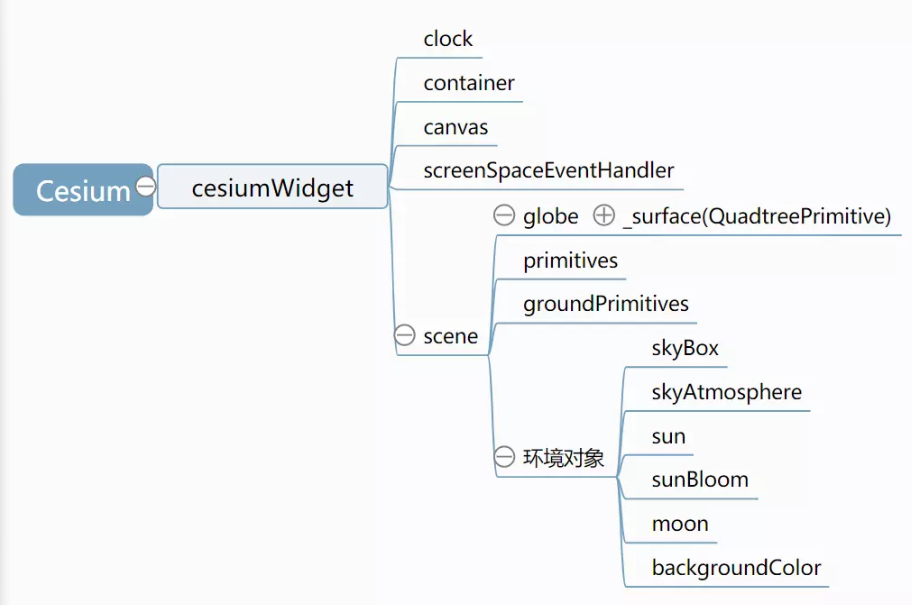

## 核心类 CesiumWidget

CesiumWidget 内部创建的对象主要有以下几个部分，如图所示:


CesiumWidget:

- clock：用来记录时间，三维场景需要进行动态展示，需要通过时间来确定某一帧的绘制内容。
- container：则是构造函数的参数，也就是传入的 div。
- canvas：则是在 container 上构建的 Canvas 类的对象，可以据此获取 WebGL 绘制的画笔。
- screenSpaceEventHandler：则是对 Canvas 对象上各种鼠标的交互事件的封装，方便传递给三维场景。三维场景干之后可以据此改变相机姿态等。
- scene：则承载着整个三维场景中的对象。

## 场景 Scene

Scene 中有一些内置的**图元对象**：

- globe（地球） Globe  
   -- imageryLayers : ImageryLayerCollection  
   -- terrainProvider : TerrainProvider
- skyBox（天空盒） SkyBox
- skyAtmosphere(大气层) SkyAtmosphere
- sun（太阳） Sun
- sunBloom Boolean
- sunColor Cartesian3
- moon（月亮） Moon
- backgroundColor Color
- primitives
- groundPrimitives

## Scene 属性

- scene.backgroundColor
- scene.camera : Camera
- scene.canvas : Canvas
- scene.globe : Globe

- scene.light : Light
- scene.moon : Moon
- scene.sun : Sun
- scene.sunBloom : Boolean
- scene.sunColor : Cartesian3

- scene.skyAtmosphere : SkyAtmosphere
- scene.skyBox : SkyBox

- scene.fog : Fog
- scene.shadowMap : ShadowMap

- scene.groundPrimitives : PrimitiveCollection
- scene.imageryLayers : ImageryLayerCollection
- scene.terrainProvider : TerrainProvider

* scene.requestRenderMode:开启后（true）仅在 scene 变化后才渲染
* scene.debugShowFramePerSecond：开启后（true）查看性能，显示每秒帧数和帧之间的时间
* scene.globe.enableLighting: 是否开启光照，默认 false
* scene.debugShowFramesPerSecond: 查看性能,默认 false
* scene.requestRenderMode: 开启后只有在 scene 变化时才渲染 ,默认 false
* scene.postRender： Event

### scene.fog:Fog

- scene.fog.enabled : 是否开启
- scene.fog.density: 雾气密度
- scene.fog.screenSpaceErrorFactor: 当地形瓦片部分处于雾中时，用于增加其屏幕空间误差的因子
- scene.fog.minimumBrightness :最小亮度

在 Cesium 中，雾是大气颜色和地平线上地形的混合。部分处于雾中的地形瓦片会增加其屏幕空间误差（SSE），这样可以渲染低分辨率的地形。  
完全在雾中的瓦片将被完全剔除，甚至不被请求。这些优化将地平线视图中渲染的瓦片和从服务器请求的瓦片的数量减少。

### scene.skyAtmosphere :SkyAtmosphere

- scene.skyAtmosphere.brightnessShift
- scene.skyAtmosphere.hueShift
- scene.skyAtmosphere.saturationShift
- scene.skyAtmosphere.show : 是否显示 Boolean

### scene.globe : Globe

- scene.globe.imageryLayers : ImageryLayerCollection
- scene.globe.terrainProvider : TerrainProvider
- scene.globe.ellipsoid : Ellipsoid

- scene.globe.enableLighting : Boolean

// Globe 色相，亮度，饱和度

- scene.globe.atmosphereHueShift : Number
- scene.globe.atmosphereBrightnessShift : Number
- scene.globe.atmosphereSaturationShift : Number
- scene.globe.

- scene.globe.show : Boolean

// Globe 性能相关

- scene.globe.tileCacheSize : Number ，A larger number will consume more memory but will show detail faster
- scene.globe.maximumScreenSpaceError : Number ， Higher values will provide better performance but lower visual quality  
  较高的 maximumScreenSpaceError 将会渲染更少的贴图，进而可以提高性能，而较低的值将提高视觉质量。
- requestRenderMode : Boolean，When true, rendering a frame will only occur when needed as determined by changes within the scene，改善性能

// 调试相关
- debugShowFramesPerSecond
- debugShowFrustumPlanes
- debugShowFrustums

//Globe 方法

- scene.globe.getHeight(cartographic) → Number|undefined, Get the height of the surface at a given cartographic

- scene.globe.pick(ray, scene, result) → Cartesian3|undefined

```
// find intersection of ray through a pixel and the globe
var ray = viewer.camera.getPickRay(windowCoordinates);
var intersection = globe.pick(ray, scene);
```

## Scene 方法

### 高度取样

#### 3D Tiles、primitives 和地球 globe 上对象高度取样

May be used to clamp objects to the globe, 3D Tiles, or primitives in the scene.

- scene.clampToHeight(cartesian, objectsToExclude, width, result) → Cartesian3
- scene.clampToHeightMostDetailed(cartesians, objectsToExclude, width) → Promise.<Array.<Cartesian3>>
- scene.sampleHeight(position, objectsToExclude, width) → Number
- scene.sampleHeightMostDetailed(positions, objectsToExclude, width) → Promise.<Array.<Cartographic>> positions:Array.<Cartographic>

sampleHeight 和 clampToHeight，按照官方文档的说法，都可以作用于 globe, 3D Tiles, or primitives，都是用来给定地理坐标，然后获取对应的高度值。参数类型略有不同，返回值一个是直接给高度，另外一个是返回一个 position.

- scene.clampToHeightSupported : Boolean
- scene.sampleHeightSupported : Boolean

#### 地形高度取样

- Cesium.sampleTerrainMostDetailed(terrainProvider, positions) → Promise.<Array.<Cartographic>>

```
// Query the terrain height of two Cartographic positions
var terrainProvider = Cesium.createWorldTerrain();
var positions = [
    Cesium.Cartographic.fromDegrees(86.925145, 27.988257),
    Cesium.Cartographic.fromDegrees(87.0, 28.0)
];
var promise = Cesium.sampleTerrainMostDetailed(terrainProvider, positions);
Cesium.when(promise, function(updatedPositions) {
    // positions[0].height and positions[1].height have been updated.
    // updatedPositions is just a reference to positions.
});
```

## Scene 事件


