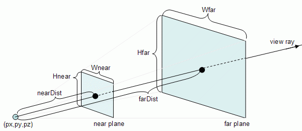
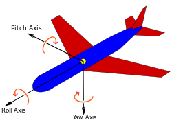

# 相机
The camera is defined by a position, orientation, and view frustum.

视锥体（frustum），是指场景中摄像机的可见的一个锥体范围。它有上、下、左、右、近、远，共6个面组成。       
在视锥体内的景物可见，反之则不可见。为提高性能，只对其中与视锥体有交集的对象进行绘制。     


近平面与远平面上的矩形区域的大小可以由fov(照相机垂直的视角)和ratio(近平面和远平面上的宽高比)计算出来。     

计算公式如下：
```
　　　　　Hnear = 2 * tan(fov / 2) * nearDist
　　　　　Wnear = Hnear * ratio
　　　　  Hfar = 2 * tan(fov / 2) * farDist
　　　　  Wfar = Hfar * ratio
```


 

## 相机的获取

```
var camera = viewer.camera;   // var viewer = new Cesium.Viewer('cesiumContainer')
var camera = viewer.scene.camera; // var viewer = new Cesium.Viewer('cesiumContainer')
var camera = widget.scene.camera; //  var widget = new Cesium.CesiumWidget('cesiumContainer');
```

## 相机的角度



- Heading 是围绕Z轴旋转，下图中yaw ---方向角/航向角
- Pitch 是围绕Y轴旋转，---俯仰角
- Roll 是围绕X轴旋转 --- 翻滚角
 
## 相机的属性

- position : Cartesian3
- positionCartographic : Cartographic
- positionWC : Cartesian3

- right : Cartesian3
- rightWC : Cartesian3

- up : Cartesian3 
- upWC : Cartesian3

- direction : Cartesian3 
- directionWC : Cartesian3

- viewMatrix : Matrix4
- transform : Matrix4 （Gets the camera's reference frame. The inverse of this transformation is appended to the view matrix.）           


## 相机的方法

- flyTo(options) ：创建从当前摄像机位置到新位置的动画摄像机飞行
- setView(options) ：立即将相机设置在特定的位置和方向

- move(direction, amount) ：沿任何方向移动相机 moveForward/moveBackward/moveUp/moveDown/moveLeft/moveRight/
- zoomIn/zoomOut(amount) ：沿着视图矢量 向前/向后 移动相机
- rotate(axis, angle) ：
- look(axis, angle)

- lookAt(target, offset) ：定位和定位相机，以给定偏移量瞄准目标点
- flyToBoundingSphere(boundingSphere, options)
 
 
 
### flyTo(options)

options	: 
 - destination	Cartesian3 | Rectangle   可以是点或者矩形
 - orientation	Object
 - duration	Number
 - complete	Camera~FlightCompleteCallback
 - cancel	Camera~FlightCancelledCallback	optional
 - easingFunction
 - maximumHeight	Number
...

```
// 1. Fly to a position with a top-down view
viewer.camera.flyTo({
    destination : Cesium.Cartesian3.fromDegrees(-117.16, 32.71, 15000.0)
});

// 2. Fly to a Rectangle with a top-down view
viewer.camera.flyTo({
    destination : Cesium.Rectangle.fromDegrees(west, south, east, north)
});

// 3. Fly to a position with an orientation using unit vectors.
viewer.camera.flyTo({
    destination : Cesium.Cartesian3.fromDegrees(-122.19, 46.25, 5000.0),
    orientation : {
        direction : new Cesium.Cartesian3(-0.04231243104240401, -0.20123236049443421, -0.97862924300734),
        up : new Cesium.Cartesian3(-0.47934589305293746, -0.8553216253114552, 0.1966022179118339)
    }
});

// 4. Fly to a position with an orientation using heading, pitch and roll.
viewer.camera.flyTo({
    destination : Cesium.Cartesian3.fromDegrees(-122.19, 46.25, 5000.0),
    orientation : {
        heading : Cesium.Math.toRadians(175.0),
        pitch : Cesium.Math.toRadians(-35.0),
        roll : 0.0
    }
});

```

### setView(options)

options	: 

- destination	Cartesian3 | Rectangle  可以是点或者矩形
- orientation	Object
- endTransform	Matrix4
- convert	Boolean


```

/ 1. Set position with a top-down view
viewer.camera.setView({
    destination : Cesium.Cartesian3.fromDegrees(-117.16, 32.71, 15000.0)
});

// 2 Set view with heading, pitch and roll
viewer.camera.setView({
    destination : cartesianPosition,
    orientation: {
        heading : Cesium.Math.toRadians(90.0), // east, default value is 0.0 (north)
        pitch : Cesium.Math.toRadians(-90),    // default value (looking down)
        roll : 0.0                             // default value
    }
});

// 3. Change heading, pitch and roll with the camera position remaining the same.
viewer.camera.setView({
    orientation: {
        heading : Cesium.Math.toRadians(90.0), // east, default value is 0.0 (north)
        pitch : Cesium.Math.toRadians(-90),    // default value (looking down)
        roll : 0.0                             // default value
    }
});


// 4. View rectangle with a top-down view
viewer.camera.setView({
    destination : Cesium.Rectangle.fromDegrees(west, south, east, north)
});

```


### move(direction, amount)

- direction	Cartesian3
- amount	Number,the amount, in meters,

见 camera5-move-zoom.html

### look(axis, angle)
### twistLeft(amount)
### twistRight(amount) 
### rotate(axis, angle)

- lookUp() 
- lookDown() 
- lookLeft() 
- lookRight()
- twistLeft()
- twistRight(
- rotateUp() 
- rotateDown()
- rotateLeft()
- rotateRight())

见 camera6-look_twist.html


### lookAt(target, offset)

- target	Cartesian3	The target position in world coordinates.
- offset	Cartesian3 | HeadingPitchRange	The offset from the target in the local east-north-up reference frame centered at the target.

```
// 1. Using a cartesian offset
var center = Cesium.Cartesian3.fromDegrees(-98.0, 40.0);
viewer.camera.lookAt(center, new Cesium.Cartesian3(0.0, -4790000.0, 3930000.0));

// 2. Using a HeadingPitchRange offset
var center = Cesium.Cartesian3.fromDegrees(-72.0, 40.0);
var heading = Cesium.Math.toRadians(50.0);
var pitch = Cesium.Math.toRadians(-20.0);
var range = 5000.0;
viewer.camera.lookAt(center, new Cesium.HeadingPitchRange(heading, pitch, range));

```
### 相机的控制参数

screenSpaceCameraController中控制相机的参数：


```
viewer.scene.screenSpaceCameraController.minimumZoomDistance = 250000;//相机的高度的最小值
viewer.scene.screenSpaceCameraController.maximumZoomDistance = 22000000;  //相机高度的最大值
viewer.scene.screenSpaceCameraController._minimumZoomRate = 30000; // 设置相机缩小时的速率
viewer.scene.screenSpaceCameraController._maximumZoomRate = 590637627    //设置相机放大时的速率
    
    
// 如果为true，则允许用户旋转相机。如果为假，相机将锁定到当前位置。此标志仅适用于2D和3D。
scene.screenSpaceCameraController.enableRotate = false;
// 如果为true，则允许用户平移地图。如果为假，相机将保持锁定在当前位置。此标志仅适用于2D和Columbus视图模式。
scene.screenSpaceCameraController.enableTranslate = false;
// 如果为true，允许用户放大和缩小。如果为假，相机将锁定到距离椭圆体的当前距离
scene.screenSpaceCameraController.enableZoom = false;
// 如果为true，则允许用户倾斜相机。如果为假，相机将锁定到当前位置。这个标志只适用于3D和哥伦布视图。
scene.screenSpaceCameraController.enableTilt = false;
```


